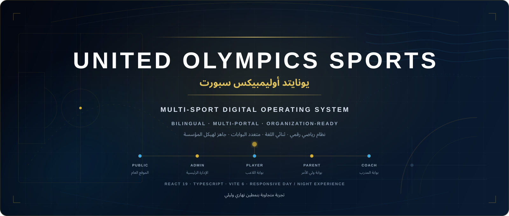
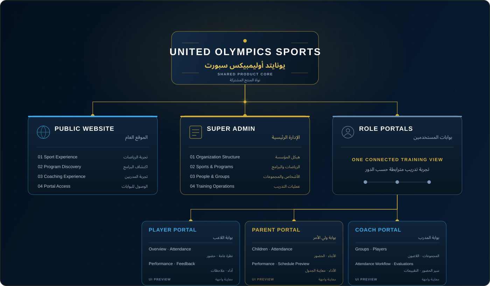

<div align="center">
  
</div>

<picture>
  <source media="(prefers-color-scheme: dark)" srcset="docs/readme/hero-dark.svg" />
  <source media="(prefers-color-scheme: light)" srcset="docs/readme/hero-light.svg" />
  
</picture>

<div align="center">
  <strong>One bilingual product system for the public experience, central administration, players, parents and coaches.</strong><br />
  <strong dir="rtl">نظام منتج ثنائي اللغة يجمع الموقع العام والإدارة المركزية واللاعبين وأولياء الأمور والمدربين.</strong>
</div>

## Product identity | هوية المنتج

**United Olympics Sports | يونايتد أوليمبيكس سبورت** is a responsive, bilingual multi-sport frontend experience built around one shared product language. The current source includes a public website, a super-admin workspace, and dedicated player, parent and coach portal previews.

**يونايتد أوليمبيكس سبورت | United Olympics Sports** تجربة واجهات رياضية متجاوبة وثنائية اللغة مبنية على لغة منتج موحدة. يتضمن المصدر الحالي موقعًا عامًا ومساحة للإدارة الرئيسية ومعاينات مخصصة لبوابات اللاعب وولي الأمر والمدرب.

> [!IMPORTANT]
> This repository is currently a high-fidelity frontend prototype. It uses isolated, anonymized preview fixtures; backend persistence, authentication, live payments and production operational data are not claimed.
>
> هذا المستودع حاليًا نموذج واجهات عالي الجودة يستخدم بيانات معاينة معزولة ومجهولة؛ ولا يدّعي وجود حفظ عبر خادم أو مصادقة أو مدفوعات حية أو بيانات تشغيل فعلية.

## Connected ecosystem | المنظومة المترابطة



The artwork above summarizes the source-backed product topology. The same architecture is also stated here as accessible Markdown:

يوضح الرسم أعلاه بنية المنتج المثبتة من المصدر، كما تظهر البنية نفسها نصيًا هنا لضمان سهولة الوصول:

| Surface | الواجهة | Verified current experience | التجربة الحالية المتحققة | Source status |
| --- | --- | --- | --- | --- |
| Public Website | الموقع العام | Sport experience, program discovery, coaching experience, portal access | تجربة الرياضات، اكتشاف البرامج، تجربة المدربين، الوصول للبوابات | Implemented frontend routes |
| Super Admin | الإدارة الرئيسية | Organization structure, sports and programs, people and groups, training operations | هيكل المؤسسة، الرياضات والبرامج، الأشخاص والمجموعات، عمليات التدريب | Core screens plus clearly marked UI previews |
| Player Portal | بوابة اللاعب | Overview, attendance, performance, coach feedback | النظرة العامة، الحضور، الأداء، ملاحظات المدرب | Interactive UI preview |
| Parent Portal | بوابة ولي الأمر | Children, attendance, performance, schedule and coach-feedback previews | الأبناء، الحضور، الأداء، معاينة الجدول وملاحظات المدرب | Interactive UI preview |
| Coach Portal | بوابة المدرب | Groups, players, session timeline, attendance workflow and evaluations | المجموعات، اللاعبون، الخط الزمني للحصص، سير الحضور والتقييمات | Interactive UI preview |

## What is in the current source | ما الموجود في المصدر الحالي

### Public experience | التجربة العامة

- Bilingual navigation and content throughout the interface | تنقل ومحتوى ثنائي اللغة في الواجهة.
- Responsive day and night visual modes | نمطان مرئيان نهاري وليلي متجاوبان.
- Media-backed football, swimming and basketball experiences | تجارب لكرة القدم والسباحة وكرة السلة مدعومة بوسائط المشروع.
- Concept experiences for tennis, gymnastics and martial arts | تجارب تصورية للتنس والجمباز والفنون القتالية.
- Program catalogue, program previews and coaching experience | كتالوج البرامج ومعاينات البرامج وتجربة المدربين.
- Direct routes into player, parent, coach and admin surfaces | روابط مباشرة إلى واجهات اللاعب وولي الأمر والمدرب والإدارة.

### Administration experience | تجربة الإدارة

- Dashboard metrics computed from shared preview fixtures | مؤشرات لوحة التحكم محسوبة من بيانات المعاينة المشتركة.
- Sports, group and player detail surfaces | واجهات تفاصيل الرياضات والمجموعات واللاعبين.
- Player attendance, performance and coach-feedback views | واجهات حضور اللاعب وأدائه وملاحظات المدرب.
- Responsive navigation, breadcrumbs and configurable interface density | تنقل متجاوب ومسار صفحات وكثافة واجهة قابلة للضبط.
- Clearly labelled visual previews for future operational modules | معاينات مرئية واضحة التسمية للوحدات التشغيلية المستقبلية.

### Role portals | بوابات الأدوار

- Player dashboard with progress, attendance and coach feedback | لوحة لاعب تشمل التقدم والحضور وملاحظات المدرب.
- Parent overview with child switching, progress, schedule, documents and finance placeholders | نظرة ولي الأمر مع التبديل بين الأبناء والتقدم والجدول ومستندات وعناصر مالية تجريبية.
- Coach workspace with roster, session timeline, attendance and evaluation workflows | مساحة المدرب مع قائمة اللاعبين والخط الزمني للحصص وسير الحضور والتقييم.

## Truth boundary | حدود الحقيقة

The repository distinguishes implemented UI, preview data and future architecture so visual polish never becomes a product claim.

يفصل ملف التعريف بين الواجهة المنفذة وبيانات المعاينة والبنية المستقبلية حتى لا يتحول الإخراج البصري إلى ادعاء وظيفي.

| Classification | التصنيف | Meaning | المعنى |
| --- | --- | --- | --- |
| Implemented frontend | واجهة منفذة | A routed React surface exists in the current branch | توجد واجهة React مرتبطة بمسار في الفرع الحالي |
| Interactive UI preview | معاينة واجهة تفاعلية | The interaction runs locally against shared demo fixtures | يعمل التفاعل محليًا باستخدام بيانات تجريبية مشتركة |
| Architecture / future module | بنية / وحدة مستقبلية | The screen communicates intended structure and explicitly avoids backend claims | توضح الشاشة الهيكل المقصود دون ادعاء عمليات خادم |
| Not claimed | غير مُدّعى | Authentication, persistence, real transactions, live notifications and production operations | المصادقة والحفظ والمعاملات الحقيقية والإشعارات الحية والتشغيل الفعلي |

“Organization-ready” describes the current country/branch hierarchy and product information architecture. It does not claim that a production multi-branch backend is connected.

يشير وصف «جاهز لهيكل المؤسسة» إلى بنية الدول والفروع وهندسة معلومات المنتج الحالية، ولا يعني وجود خادم إنتاج متعدد الفروع متصل.

## Route map | خريطة المسارات

| Route | Experience | التجربة |
| --- | --- | --- |
| `/` | Public home | الصفحة العامة الرئيسية |
| `/sports` | Sports catalogue | كتالوج الرياضات |
| `/sports/football` · `/sports/swimming` · `/sports/basketball` | Media-backed sport pages | صفحات رياضية مدعومة بالوسائط |
| `/sports/tennis` · `/sports/gymnastics` · `/sports/martial-arts` | Sport concept pages | صفحات تصورية للرياضات |
| `/programs` · `/programs/:programSlug` | Programs and program preview | البرامج ومعاينة البرنامج |
| `/coaches` | Coaching experience | تجربة المدربين |
| `/player` · `/parent` · `/coach` | Role-based product previews | معاينات المنتج حسب الدور |
| `/admin` | Super-admin dashboard | لوحة الإدارة الرئيسية |
| `/admin/sports/*` · `/admin/players/*` | Detailed admin surfaces | واجهات إدارية تفصيلية |
| Other `/admin/*` modules | Labelled high-fidelity UI previews | معاينات واجهة عالية الجودة ومعلّمة بوضوح |

## Technical foundation | الأساس التقني

| Layer | Technology | الدور |
| --- | --- | --- |
| UI | React 19 + TypeScript | واجهة المنتج والمكونات المكتوبة بأنواع صريحة |
| Routing | React Router 7 | تنقل الموقع العام والإدارة والبوابات |
| Build | Vite 6 | التطوير المحلي وبناء الإنتاج |
| Motion | Motion for React | الحركة مع احترام تفضيل تقليل الحركة |
| Icons | Lucide React | أيقونات الواجهة المشتركة |
| Styling | CSS design system | الهوية البصرية والاستجابة والنمطين النهاري والليلي |
| Data | Isolated TypeScript fixtures | بيانات معاينة محلية ومجهولة بلا ادعاء تشغيل حي |

## Local development | التشغيل المحلي

Requirements | المتطلبات: **Node.js 20+** and **npm**.

```bash
npm install
npm run dev
```

The development server runs on `http://localhost:3000` by default.

يعمل خادم التطوير افتراضيًا على `http://localhost:3000`.

### Verification commands | أوامر التحقق

```bash
npm run lint
npm run build
git diff --check
```

`npm run lint` currently executes TypeScript's no-emit validation. `npm run build` produces the Vite production bundle in `dist/`.

ينفذ أمر `npm run lint` حاليًا تحقق TypeScript دون إنشاء ملفات، بينما ينشئ `npm run build` حزمة Vite الإنتاجية داخل `dist/`.

## Repository map | خريطة المستودع

```text
public/
  brand/                 Official United Olympics Sports identity
  media/sports/          Verified project media collections
src/
  app/                   Application routing
  components/            Shared bilingual, admin and preview UI
  data/                   Isolated demo fixtures and media registries
  domain/                 Typed product contracts
  layouts/                Super-admin application shell
  pages/                  Public, admin and role-portal surfaces
  styles/                 Responsive day/night visual system
  ui/                     Theme settings and icon registry
docs/readme/              Theme-aware repository artwork
```

## Current phase | المرحلة الحالية

**Mission 08 — Branch `frontend-product-architecture-closure`**

The current phase focuses on closing the frontend product architecture: maintaining bilingual parity, strengthening the shared visual system, connecting the five product surfaces, preserving source-truthful preview boundaries and completing the repository presentation without inventing backend capability.

تركز المرحلة الحالية على إغلاق هندسة المنتج الأمامية: الحفاظ على التكافؤ بين العربية والإنجليزية، وتعزيز النظام البصري المشترك، وربط واجهات المنتج الخمس، وحماية حدود المعاينة المطابقة للمصدر، واستكمال عرض المستودع دون اختلاق قدرات خادم.

## Brand and content guardrails | ضوابط الهوية والمحتوى

- The public brand is always **United Olympics Sports | يونايتد أوليمبيكس سبورت**.
- The official asset at `public/brand/united-olympics-sports-logo.png` is the identity anchor; the repository does not introduce a replacement emblem.
- Every product-facing English label is paired with Arabic in the same experience.
- Real people, addresses, schedules, prices, transactions and operational results are not invented.
- Preview fixtures stay isolated from production claims and are described as preview data in the interface.

---

<div align="center">
  <strong>United Olympics Sports | يونايتد أوليمبيكس سبورت</strong><br />
  <sub>Designed as one connected sporting product system | صُمم كنظام منتج رياضي واحد مترابط</sub>
</div>
